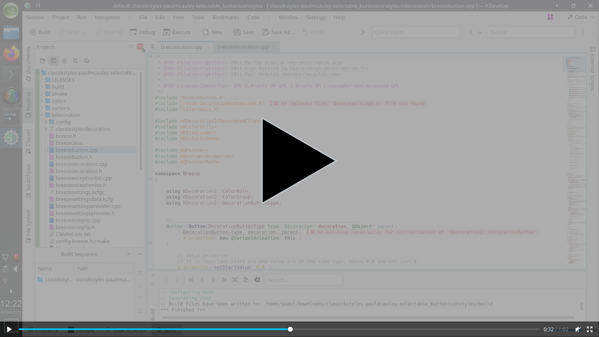
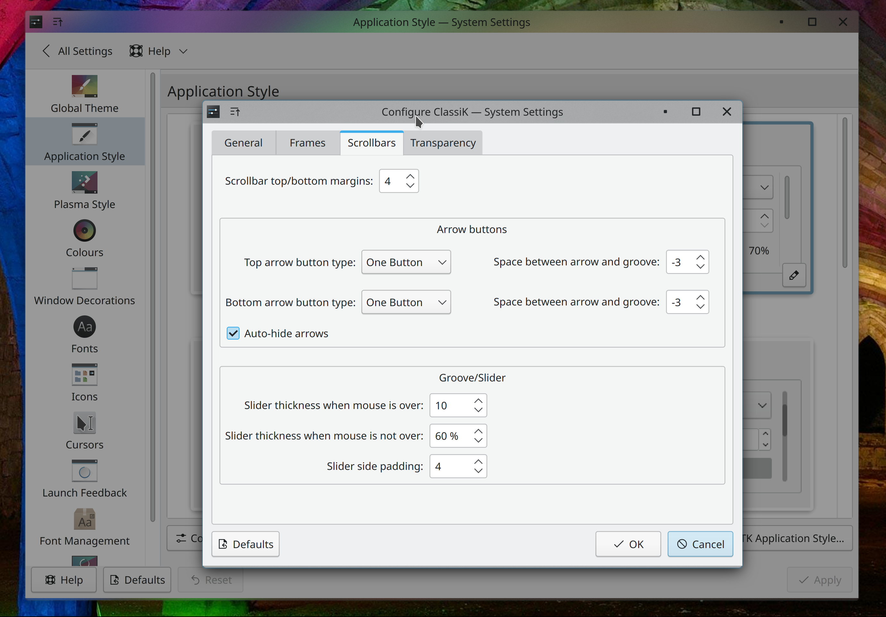
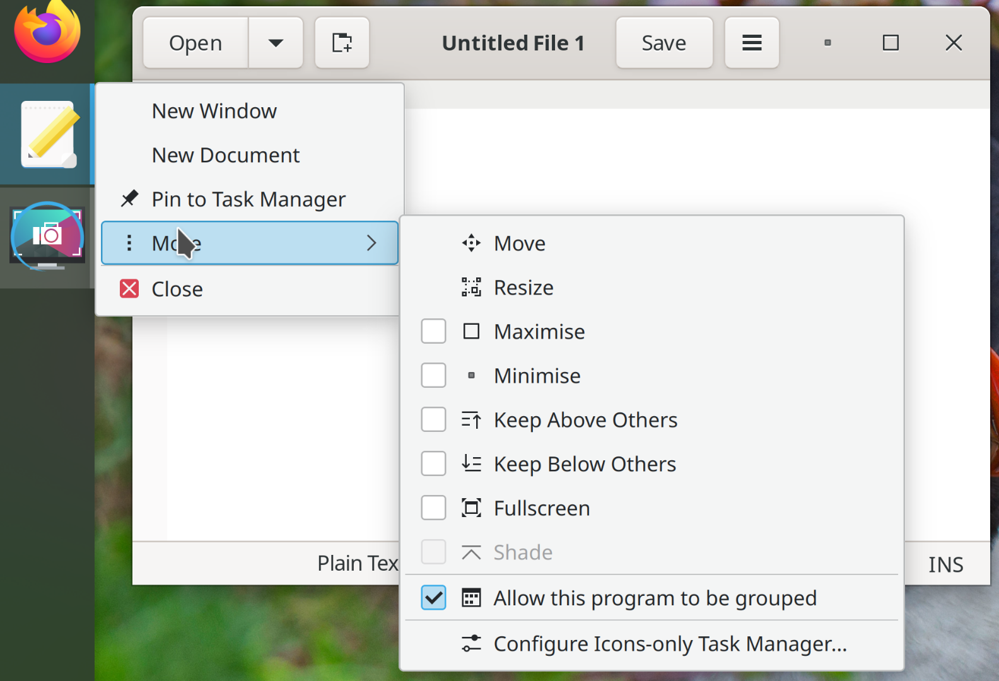

# Klassy

##### Table of Contents
[Overview](#overview)  
[Installation](#installation)  
>[Pre-built packages](#prebuilt)  
>[Compile from source](#compile)  

[System icon theme](#icons)  
[Klassy Settings](#klassy-settings)  
[Donations](#donations)

&nbsp;

<a name="overview"/>

## Overview
_Klassy_ (formerly _ClassiK_/_ClassikStyles_) is a highly customizable binary Window Decoration, Application Style and Global Theme plugin for recent versions of the KDE Plasma desktop. Initially taking inspiration from the iconography of KDE 1, the _Klassy_ defaults are an attempt to create a usable and appealing look for the modern Plasma desktop. Install with the instructions below, and then make sure it is enabled in System Settings -> Appearance -> Window Decorations, in System Settings -> Appearance -> Application Style and in System Settings -> Appearance -> Icons.


>(Above Preset: Glassy Klassy, Colours: Klassy Dark)
* Also provides _Oxygen/Breeze_ and _Redmond_ button icons.
* Provides a Window Decoration, Application Style and Icons so that icons in dockable panels, MDI applications, context menus and GTK applications consistently match the main titlebar icons (make sure to enable all 3 in your Plasma Appearance settings!):
> [](http://paulmcauley.com/kde/klassy/klassy_demo.webm)

* Configurable button size, shape, translucency, colours and outlining.

* Default buttons (_Klassy_ preset) are "Integrated Rounded Rectangles" with translucent outlined accent colours, with a large clickable area. These are designed to complement the "Blue Ocean" design refresh in Plasma 5.23, along with the Plasma 5.23 accent colour feature:
> 
* Alternative "Traffic lights" background colours:
> 

* Alternative "Full-height Rounded Rectangle" button shape (_ClassiK v3_ preset):
> 
> 
> 


* Full-height Rectangular (_ClassikStyles_ preset) or Circular (_Classik-Aurorae_ preset) button highlights:
> 

* Ability to inherit system colour-scheme highlight colours for hover and focus, as well as titlebar colour. Auto-enhances contrast in cases where it is poor.
* Option to have matching titlebar colour and border colour.

* Configurable button spacing (left and right), titlebar margins (sides, top/bottom and option for different maximized), corner radius; all with scaling for HiDPI:
> 

* Transparency/opacity configurable for both active/inactive titlebars/headers; setting to make maximized windows opaque; blur is configurable:

* Configurable thin window outline with optional accent colours:
> ")
> ")

* Configurable scrollbars:
> 

* Configurable animations

* Ability to load icons from the system icon theme. `window-*-symbolic` icons are recommended for this purpose. If the icons have been designed properly with SVG CSS properties then they will be colourized by default. You can also force the colourization of any symbolic icon by checking the _Force-colourize icons_ window decoration setting.

&nbsp;

<a name="installation"/>

## Installation
_Klassy_ master branch requires a development version of Plasma 6.0.80 so please check you have this in kinfocenter before trying to install. You can either download the pre-built packages or compile from source.
<a name="prebuilt"/>

### Pre-built packages
[Respositories are available from the Open Build Service](https://software.opensuse.org//download.html?project=home%3Apaul4us&package=klassy) for OpenSUSE, Debian/Ubuntu/KDE Neon, Fedora, Mageia and Arch/Manjaro to keep you on the latest version.

&nbsp;

Raw .rpm, .deb etc. binary packages are also available from the Open Build Service link above if you choose "Grab binary packages directly".

&nbsp;
&nbsp;
<a name="compile"/>

### Compile from source
### Step 1: First, Install Dependencies
#### OpenSUSE Tumbleweed/Leap build dependencies
```
sudo zypper in git cmake kf6-extra-cmake-modules gettext &&
sudo zypper in "cmake(KF5Config)" "cmake(KF5CoreAddons)" "cmake(KF5FrameworkIntegration)"  "cmake(KF5GuiAddons)" "cmake(KF5Kirigami2)" "cmake(KF5WindowSystem)" "cmake(KF5I18n)" "cmake(KF5KCMUtils)" "cmake(Qt5DBus)" "cmake(Qt5Quick)" "cmake(Qt5Widgets)" "cmake(Qt5X11Extras)" "cmake(KDecoration2)" "cmake(KF6ColorScheme)" "cmake(KF6Config)" "cmake(KF6CoreAddons)" "cmake(KF6FrameworkIntegration)" "cmake(KF6GuiAddons)" "cmake(KF6I18n)" "cmake(KF6KCMUtils)" "cmake(KF6KirigamiPlatform)" "cmake(KF6WindowSystem)" "cmake(Qt6Core)" "cmake(Qt6DBus)" "cmake(Qt6Quick)" "cmake(Qt6Svg)" "cmake(Qt6Widgets)" "cmake(Qt6Xml)"
```

#### Debian/Ubuntu/KDE Neon build dependencies
```
sudo apt install git build-essential cmake kf6-extra-cmake-modules kf6-extra-cmake-modules kf6-frameworkintegration-dev kf6-kcmutils-dev kf6-kcolorscheme-dev kf6-kconfig-dev kf6-kconfigwidgets-dev kf6-kcoreaddons-dev kf6-kguiaddons-dev kf6-ki18n-dev kf6-kiconthemes-dev kf6-kirigami2-dev kf6-kpackage-dev kf6-kservice-dev kf6-kwindowsystem-dev kirigami2-dev kwayland-dev libx11-dev libkdecorations2-dev libkf5config-dev libkf5configwidgets-dev libkf5coreaddons-dev libkf5guiaddons-dev libkf5i18n-dev libkf5iconthemes-dev libkf5kcmutils-dev libkf5package-dev libkf5service-dev libkf5style-dev libkf5wayland-dev libkf5windowsystem-dev libplasma-dev libqt5x11extras5-dev qt6-base-dev qt6-declarative-dev qtbase5-dev qtdeclarative5-dev gettext qt6-svg-dev
```

#### Arch/Manjaro build dependencies
```
sudo pacman -S git frameworkintegration gcc-libs glibc kcmutils kcolorscheme kconfig kcoreaddons kdecoration kguiaddons ki18n kiconthemes kirigami kwidgetsaddons kwindowsystem qt6-base qt6-declarative qt6-svg xdg-utils extra-cmake-modules kcmutils5 frameworkintegration5 kconfigwidgets5 kiconthemes5 kirigami2 kwindowsystem5
```

#### Fedora build dependencies
```
sudo dnf install git cmake extra-cmake-modules gettext
sudo dnf install "cmake(KF5Config)" "cmake(KF5CoreAddons)" "cmake(KF5FrameworkIntegration)"  "cmake(KF5GuiAddons)" "cmake(KF5Kirigami2)" "cmake(KF5WindowSystem)" "cmake(KF5I18n)" "cmake(Qt5DBus)" "cmake(Qt5Quick)" "cmake(Qt5Widgets)" "cmake(Qt5X11Extras)" "cmake(KDecoration2)" "cmake(KF6ColorScheme)" "cmake(KF6Config)" "cmake(KF6CoreAddons)" "cmake(KF6FrameworkIntegration)" "cmake(KF6GuiAddons)" "cmake(KF6I18n)" "cmake(KF6KCMUtils)" "cmake(KF6KirigamiPlatform)" "cmake(KF6WindowSystem)" "cmake(Qt6Core)" "cmake(Qt6DBus)" "cmake(Qt6Quick)" "cmake(Qt6Svg)" "cmake(Qt6Widgets)" "cmake(Qt6Xml)"
```

### Step 2: Then download, build and install
Download, build and install from source script:
```
git clone https://github.com/paulmcauley/klassy
cd klassy
git checkout master
./install.sh
```

Uninstall build script:
```
./uninstall.sh
```

&nbsp;
<a name="icons"/>

## System icon theme
To make your Plasma Desktop fully consistent, Klassy auto-generates "Klassy" and "Klassy Dark" system icon themes whenever a window-decoration setting changes. These add consistent titlebar button icons to certain minor context menus in Plasma, and also add consistent GTK application titlebar icons.
> 

These icons inherit the _Breeze_ icon theme by default, only overriding the titlebar button icons. Another icon theme may be inherited by changing the setting in the Window Decoration settings under the _System Icon Generation..._ button.

<a name="klassy-settings"/>

## Klassy Settings
Klassy includes a settings application, `klassy-settings`. This shows Window Decoration and Application Style settings in one place.

`klassy-settings` also has command-line options to allow Preset file imports, load Presets and generate system icons. Run `klassy-setttings --help` for details.

<a name="donations"/>

## Donations
[](https://liberapay.com/paulmcauley/donate)
or [](https://www.paypal.com/donate?business=6N9RP4LDLNZCC&currency_code=GBP)
