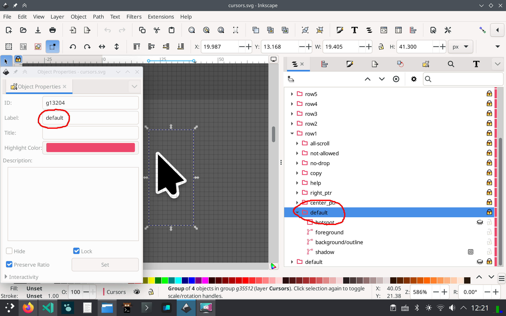
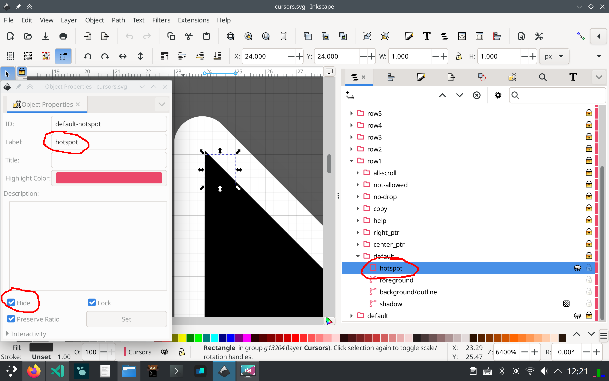
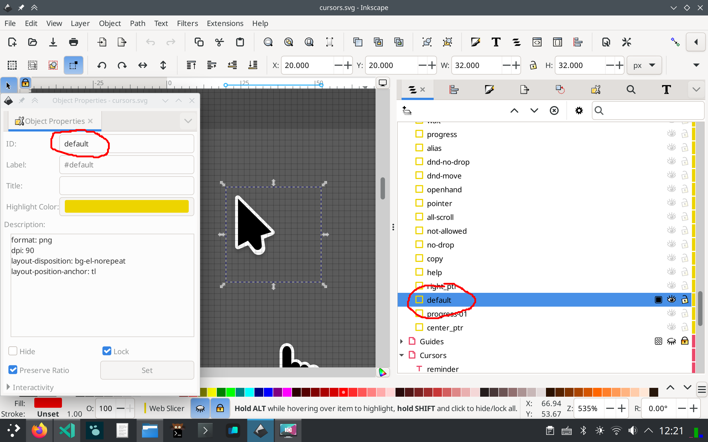

# Requirements for the cursor.svg file

The source file of Breeze cursors is a single `src/cursors.svg` file, created in Inkscape.
The `build.sh` script, which generates cursor files from the source, requires the following:

## Visible parts of the cursor

All visible parts of the cursor must be in a group labeled `<cursor-name>` in the `Cursors` layer.

.

## Hotspot

The group of the cursor must contain an invisible rectangle labeled `hotspot`. The top-left
corner of the rectangle defines the hotspot of the cursor.

.

## View box

The `Web Slicer` layer must contain a rectangle with `<cursor-name>` as the ID. It defines the
view box for that cursor. The rectangle should have a size of 32x32, and all visible parts of the cursor should fall inside it.

.

## Animated cursors

Animated cursors are created by manually adding `<AnimatedTrasform>` elements to individual SVG
files for each animated cursor. See [building-breeze-cursors](svg-cursor/building-breeze-cursors.md) for details.
